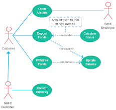

# TEST
Markdown Testing

<!-- Headings -->
# Heading 1
## Heading 2
### Heading 3
#### Heading 4
##### Heading 5
###### Heading 6

<!-- Italics -->
*This text* is italic

_This text_ is italic

<!-- Strong -->
**This text** is italic

__This text__ is italic

<!-- Strikethrough -->
~~This text~~ is strikethrough

<!-- Horizontal Rule -->

---
___

<!-- Blockquote -->
> This is a quote

<!-- Links -->
[Traversy Media](http://www.traversymedia.com)

[Traversy Media](http://www.traversymedia.com "Traversy Media")

<!-- UL -->
* Item 1
* Item 2
* Item 3
  * Nested Item 1
  * Nested Item 2

<!-- OL -->
1. Item 1
1. Item 2
1. Item 3

<!-- Inline Code Block -->
`<p>This is a paragraph</p>`

<!-- Images -->


<!-- Github Markdown -->

<!-- Code Blocks -->
```bash
  npm install

  npm start
```

```javascript
  function add(num1, num2) {
    return num1 + num2;
  }
```

```python
  def add(num1, num2):
    return num1 + num2
```

<!-- Tables -->
| Name     | Email          |
| -------- | -------------- |
| John Doe | john@gmail.com |
| Jane Doe | jane@gmail.com |

<!-- Task List -->
* [x] Task 1
* [x] Task 2
* [ ] Task 3



